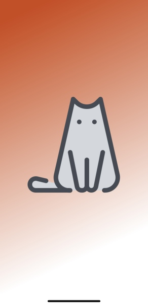
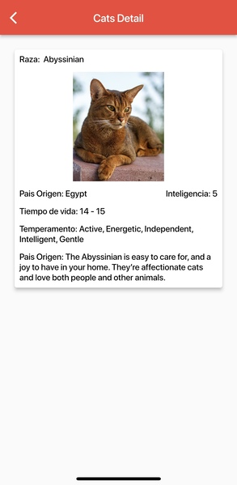

# CatApp

A Flutter CatApp app

## OS
1. Android
2. IOS

## Language Application Support
Spanish

## Framework and language
1. Flutter v- 3.3.2
2. Dart

## Libraries
1. get
2. http
3. flutter_svg
4. skeletons
5. animate_do
6. flutter_launcher_icons

## API's

https://thecatapi.com/

### Get all breeds
``` javascript
fetch('https://api.thecatapi.com/v1/breeds')
            .then(res=>res.json())
            .then(json=>console.log(json))
```

### Get a single cat
``` javascript
fetch('https://api.thecatapi.com/v1/images/')
            .then(res=>res.json())
            .then(json=>console.log(json))
```


## Authors
- [@IvanZeroi96](https://github.com/IvanZeroi96)

## Donate
[](https://www.paypal.com/paypalme/IvanZeroi)

## Boost

Puedes apoyarme haciendo "☆ Star" en el repo o impulsarme a "GitHub Star".

[](https://stars.github.com/nominate/)

## Images




